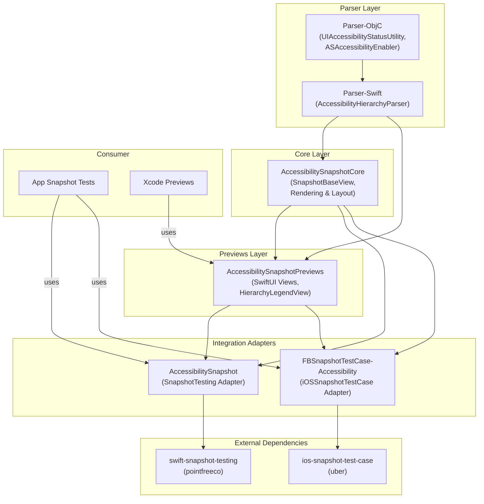

# AccessibilitySnapshot - Architecture

## High-Level Architecture

## Architectural Patterns

### Layered Library Architecture
The library follows a strict dependency chain: Parser-ObjC → Parser-Swift → Core → Integration layers. Each layer only depends on layers below it.

### Adapter / Integration Pattern
Core accessibility parsing and rendering logic is decoupled from snapshot comparison frameworks. Multiple adapter targets (SnapshotTesting, iOSSnapshotTestCase) allow consumers to choose their preferred framework.

### Mixed ObjC/Swift Bridging
Low-level accessibility APIs are accessed through Objective-C (`ASAccessibilityEnabler`, `UIAccessibilityStatusUtility`) and exposed to Swift via module maps.

## Layers

| Layer | Purpose | Dependencies |
|-------|---------|-------------|
| **Parser (ObjC)** | Low-level accessibility introspection, status mocking | None |
| **Parser (Swift)** | Hierarchy extraction into structured markers | Parser ObjC |
| **Core** | Snapshot rendering, overlay drawing, legend layout | Parser Swift |
| **Previews** | SwiftUI-based overlay and legend rendering | Core, Parser Swift |
| **SnapshotTesting Adapter** | pointfreeco integration | Core, Previews, Parser ObjC |
| **iOSSnapshotTestCase Adapter** | uber/FBSnapshotTestCase integration | Core, Previews, Parser ObjC |

## Data Flows

### Accessibility Snapshot Generation (UIKit Path)
1. Test invokes snapshot assertion via adapter
2. Adapter creates `AccessibilitySnapshotView` wrapping the target UIView
3. `AccessibilitySnapshotBaseView.parseAccessibility()` captures image and extracts markers
4. Core layer renders highlights and legend onto the snapshot image
5. Adapter passes rendered image to underlying framework for comparison

### Accessibility Snapshot Generation (SwiftUI Path)
1. `SwiftUIAccessibilitySnapshotContainerView` wraps user content
2. Parser extracts accessibility hierarchy from the rendered view
3. Overlays are baked onto the snapshot image as a flat UIImage
4. Legend (flat or hierarchical) is composed alongside the snapshot
5. Result captured for comparison

### CI Pipeline
1. Push/PR triggers GitHub Actions CI workflow
2. SPM build job validates package compiles
3. Localized strings validation checks resource consistency
4. Tuist build jobs (iOS 17, 18, 26) generate project, build, and run snapshot tests
5. Failed test results and reference images uploaded as artifacts

## Integrations

| Service | Purpose | Type |
|---------|---------|------|
| swift-snapshot-testing | Image diffing strategies | Library (>=1.10.0) |
| ios-snapshot-test-case | Reference image management | Library (>=8.0.0) |
| Paralayout (Square) | Layout utility for demo app | Library (>=1.0.0) |
| GitHub Actions | CI/CD across iOS 17/18/26 | Workflow |
| Tuist | Project generation and build orchestration | Build tooling |

## Deployment
- **Type**: iOS Library (SPM)
- **Minimum iOS**: 13.0 (main library), 16.0 (SwiftUI Previews)
- **Distribution**: Swift Package Manager with modular product targets
- **CI**: iOS Simulator (iOS 17.5, 18.5, 26.2) on macOS-14/15 runners
