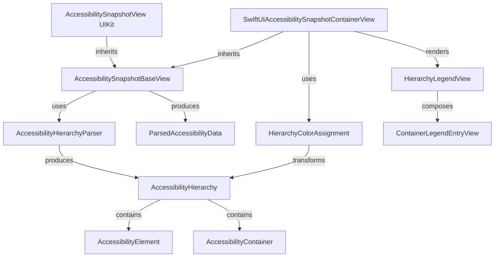

# AccessibilitySnapshot - Concept Map

## Core Concepts

### AccessibilityHierarchy
A recursive enum representing the accessibility tree as either leaf elements (`.element`) or container nodes (`.container`) grouping children. Supports flattening to elements or containers and depth-first traversal.

### AccessibilityElement (aka AccessibilityMarker)
A leaf node representing a single VoiceOver-focusable element with description, label, value, traits, shape, activation point, custom actions, custom content, custom rotors, user input labels, and language.

### AccessibilityContainer
Metadata for a container node in the hierarchy tree. Has a ContainerType enum (`semanticGroup`, `list`, `landmark`, `dataTable`, `tabBar`) and a frame in the root view coordinate space.

### AccessibilityHierarchyParser
The core parsing engine that walks a UIView tree, discovers accessibility elements and containers, sorts them in VoiceOver traversal order, applies context (series index, tab position, data table cell, list/landmark boundaries), and builds the AccessibilityHierarchy tree.

### AccessibilitySnapshotConfiguration
Central configuration object controlling all snapshot rendering options: view rendering mode, color rendering mode, marker colors, activation point display, input label display, rotor display, unspoken traits visibility, and container visibility (`showContainers` flag).

### AccessibilitySnapshotBaseView
Abstract UIView base class that orchestrates the capture-parse-render pipeline: captures the contained view as an image, parses its accessibility hierarchy, builds ParsedAccessibilityData, and delegates rendering to subclasses.

### ParsedAccessibilityData
Value type bundling the results of accessibility parsing: the rendered snapshot UIImage, flat array of AccessibilityMarkers, the full AccessibilityHierarchy tree, and the contained view's bounds size.

### HierarchyColorAssignment
Assigns deterministic color indices to hierarchy nodes. Elements use their flat traversal index; containers get sequential indices starting after all elements. Computes bounding rects for containers from child element frames.

### ColorPalette
Manages cyclic color assignment for overlay markers and legend entries. Provides fill and stroke colors with configurable opacity. Ships with `legacy` (7 basic colors) and `modern` (13 muted colors) presets.

## Terminology

| Term | Definition |
|------|-----------|
| **VoiceOver Traversal Order** | The order VoiceOver iterates through elements using flick navigation, determined by position and layout direction |
| **Accessibility Marker** | Legacy name for AccessibilityElement (type alias) |
| **Container Type** | Enum of container semantics: semanticGroup, list, landmark, dataTable, tabBar |
| **Activation Point** | Screen coordinate where VoiceOver triggers an action for an element |
| **Custom Rotor** | UIAccessibilityCustomRotor providing quick navigation between related elements |
| **Custom Content** | Additional label-value pairs via AXCustomContent, read by VoiceOver's More Content rotor |
| **Custom Action** | Named actions on an element, navigable via VoiceOver's actions rotor |
| **User Input Labels** | Labels used by Voice Control for voice-driven interaction |
| **AccessibilityContentDisplayMode** | Three-state enum: `.always`, `.whenOverridden`, `.never` |
| **ViewRenderingMode** | `.renderLayerInContext` (CALayer render) or `.drawHierarchyInRect` (UIView drawHierarchy) |
| **Unspoken Traits** | Traits like keyboardKey, playsSound not announced by VoiceOver but affecting behavior |
| **Shape** | Visual representation of element's focusable region: CGRect frame or UIBezierPath |
| **Context** | Parser-assigned metadata: series index/count, tab position, data table cell coordinates, list/landmark boundaries |
| **DesignTokens** | Namespace for visual constants: corner radii, stroke widths, badge sizes, typography |

## Relationships

## Design Patterns

| Pattern | Application |
|---------|------------|
| **Recursive Enum Tree** | AccessibilityHierarchy uses `.element`/`.container` cases for type-safe tree traversal |
| **Template Method** | AccessibilitySnapshotBaseView defines `parseAccessibility()`, subclasses implement `render(data:)` |
| **Configuration Object** | AccessibilitySnapshotConfiguration centralizes all options with sensible defaults |
| **Flatten/Unflatten** | Hierarchy tree flattens to element list or container list for different consumers |
| **Bridge Pattern** | SwiftUIAccessibilitySnapshotContainerView bridges UIKit base class with SwiftUI rendering |
| **Backwards Compatibility Aliases** | `AccessibilityMarker = AccessibilityElement`, deprecated initializers preserved |

## Domain Boundaries

| Context | Scope | Owns |
|---------|-------|------|
| **Parser** | AccessibilitySnapshotParser module | UIView tree walking, element discovery, container detection, sorting, hierarchy construction |
| **Core Rendering** | AccessibilitySnapshotCore module | Capture-parse-render pipeline, UIKit overlays and legends, configuration |
| **SwiftUI Previews** | AccessibilitySnapshotPreviews module | SwiftUI overlays, hierarchical legends, container visualization |

## Cross-Cutting Concerns

- **Coordinate Space**: All shapes, frames, activation points converted to root view's coordinate space during parsing
- **Display Mode Filtering**: AccessibilityContentDisplayMode applied consistently across activation points, input labels, rotors
- **Color Assignment Consistency**: Elements get same color index regardless of container mode
- **Layout Direction Awareness**: VoiceOver traversal respects LTR vs RTL
- **Codable Serialization**: All domain types support Codable with custom encoding for UIKit types
