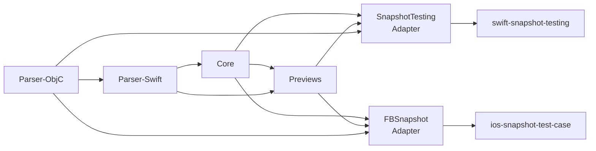

# AccessibilitySnapshot - Modules

## Module Overview

| Module | Files | LOC | Purpose |
|--------|-------|-----|---------|
| AccessibilitySnapshotParser | 8 | 2,801 | Parse UIKit view hierarchies into accessibility trees |
| AccessibilitySnapshotParser-ObjC | 3 | 323 | ObjC runtime utilities for accessibility enablement |
| AccessibilitySnapshotCore | 22 | 2,994 | UIKit rendering engine for overlays and legends |
| AccessibilitySnapshotPreviews | 22 | 2,197 | SwiftUI rendering of overlays and legends |
| AccessibilitySnapshot (SnapshotTesting) | 3 | 712 | pointfreeco/swift-snapshot-testing adapter |
| FBSnapshotTestCase-Accessibility | 9 | 1,320 | uber/ios-snapshot-test-case adapter |

## Module Dependency Graph

## AccessibilitySnapshotParser

**Path**: `Sources/AccessibilitySnapshot/Parser/Swift`
**Responsibility**: Parse UIKit view hierarchies into a tree of accessibility elements and containers ordered by VoiceOver traversal.

**Key Types**:
- `AccessibilityHierarchyParser` — Core parser engine
- `AccessibilityElement` / `AccessibilityMarker` — Leaf element data
- `AccessibilityHierarchy` — Recursive tree enum
- `AccessibilityContainer` — Container metadata with type
- `KeyboardShortcutParser` — Keyboard shortcut extraction

**Public API**:
- `parseAccessibilityHierarchy(in:rotorResultLimit:) → [AccessibilityHierarchy]`
- `[AccessibilityHierarchy].flattenToElements() → [AccessibilityElement]`
- `[AccessibilityHierarchy].flattenToContainers() → [AccessibilityContainer]`

## AccessibilitySnapshotCore

**Path**: `Sources/AccessibilitySnapshot/Core`
**Responsibility**: Orchestrate snapshot capture pipeline and provide UIKit-based rendering of overlays and legends.

**Key Types**:
- `AccessibilitySnapshotBaseView` — Abstract base with template method pattern
- `AccessibilitySnapshotView` — UIKit overlay/legend implementation
- `AccessibilitySnapshotConfiguration` — Centralized configuration
- `ParsedAccessibilityData` — Parsed result bundle
- `SnapshotAndLegendView` — Adaptive layout (bottom/right legend)
- `LayoutEngine` — UIKit vs SwiftUI rendering selection
- `ColorPalette` — Cyclic color assignment
- `LegendLayoutMetrics` — Shared layout constants

**Public API**:
- `AccessibilitySnapshotBaseView.parseAccessibility() throws`
- `AccessibilitySnapshotConfiguration(viewRenderingMode:...showContainers:)`
- `LayoutEngine.default`

## AccessibilitySnapshotPreviews

**Path**: `Sources/AccessibilitySnapshot/AccessibilitySnapshotPreviews`
**Responsibility**: SwiftUI rendering of accessibility snapshot overlays, legends, and container hierarchy visualizations.

**Key Types**:
- `AccessibilitySnapshotView<Content>` — SwiftUI snapshot view for Previews
- `PreParsedAccessibilitySnapshotView` — Pre-parsed data display
- `SwiftUIAccessibilitySnapshotContainerView` — UIKit bridge for SwiftUI rendering
- `ElementOverlay` / `NumberBadge` — Overlay components
- `HierarchyLegendView` / `HierarchyColorAssignment` — Container hierarchy visualization
- `ContainerOverlayView` / `ContainerLegendEntryView` — Container-specific views
- `ColumnWrapLayout` / `PillFlowLayout` — Custom layout primitives
- `DesignTokens` — Visual constants

**Public API**:
- `View.accessibilityPreview()` — Xcode Preview integration
- `ElementOverlay(index:shape:palette:)`
- `HierarchyLegendView(nodes:palette:...)`

## Integration Adapters

### SnapshotTesting Adapter
**Path**: `Sources/AccessibilitySnapshot/SnapshotTesting`
- `Snapshotting<UIView, UIImage>.accessibilityImage(...)`
- `Snapshotting<UIView, UIImage>.imageWithSmartInvert(...)`
- `Snapshotting<UIView, UIImage>.imageWithHitTargets(...)`

### FBSnapshotTestCase Adapter
**Path**: `Sources/AccessibilitySnapshot/iOSSnapshotTestCase`
- `FBSnapshotTestCase.SnapshotVerifyAccessibility(...)`
- `FBSnapshotTestCase.SnapshotVerifyWithInvertedColors(...)`
- `FBSnapshotTestCase.SnapshotVerifyWithHitTargets(...)`

## Cross-Module Patterns

| Pattern | Description | Modules |
|---------|-------------|---------|
| **Layered Architecture** | Strict dependency chain, each layer depends only on layers below | All |
| **Template Method** | BaseView defines pipeline, subclasses implement render() | Core, Previews |
| **Strategy (Layout Engine)** | LayoutEngine enum selects UIKit vs SwiftUI at API level | Core, Previews, Adapters |
| **Dual Integration** | Two parallel adapter targets sharing Core and Previews | Adapters |
| **Shared Layout Metrics** | LegendLayoutMetrics constants used by both UIKit and SwiftUI | Core, Previews |
| **Tree-to-Flat Adapter** | Hierarchy tree flattens to element/container lists for different consumers | Parser, Core, Previews |
