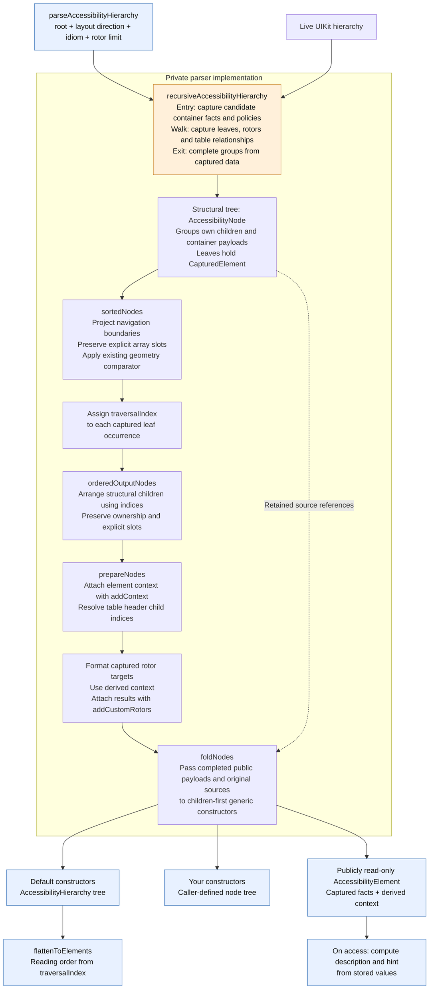
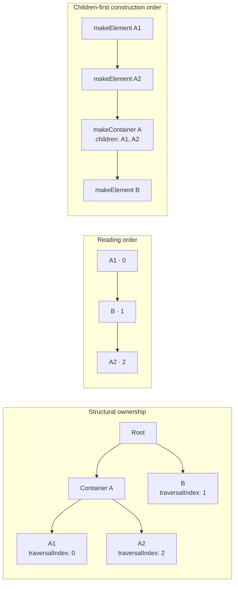
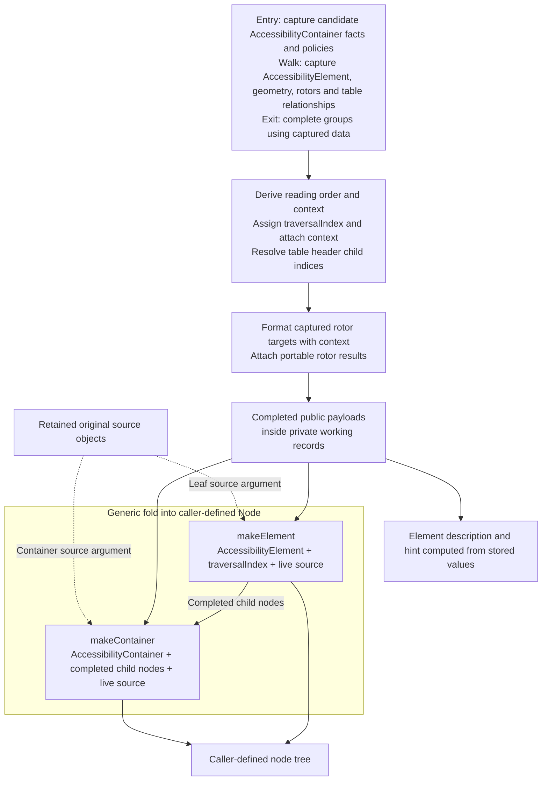

# Parser design

## 1. The parser pipeline

Blue is the public API/model. Orange marks the phase that reads live UIKit data. The parser keeps its working records private and stores public payloads inside them.



| Private type | What it carries |
|---|---|
| `CapturedElement` | Public `AccessibilityElement` value, original strong source, sorting frame, raw rotor captures, view flag, traversal index |
| `ContainerInfo` | Public `AccessibilityContainer` payload, original strong source, role, navigation/context rules, tab/table facts |
| `CapturedDataTable` | Call-scoped reference record retaining the live table source and parent-table link; accumulates captured cell relationships and a header cache as sources are encountered |
| `AccessibilityNode` | Either a captured leaf or a group of child nodes, with explicit-order and group-anchor information |

On entry to a container candidate, the walk captures its own candidate public `AccessibilityContainer` metadata, geometry, and policies before selecting or visiting children. Ancestor container getters therefore run before descendant capture. On exit, group completion uses only captured data to determine whether accessible descendants exist, whether to emit a container, and any child-inferred role.

Leaf public values, geometry, and raw rotor targets are captured when their sources are encountered. Table cell and header relationship queries are recorded as sources are discovered during the live walk; context and header child indices are resolved later from captured facts and the ordered tree. Sorting and rotor formatting also use captured data. All live reads finish before the generic fold invokes caller constructors.

The caller should settle layout before parsing; the sequential walk captures values as it proceeds rather than making an atomic UIKit snapshot. Later source mutations, including getter-driven mutations, do not update fields or geometry already captured.

## 2. Structural ownership and reading order

The tree answers “who owns this?” The traversal index answers “when is this visited?”

Here, container A owns A1 and A2, while B falls between them in reading order.



The structural and navigation projections share the same `CapturedElement` instances. Attaching context to the stored value or assigning an index updates the occurrence that both projections refer to. Repeated appearances of one live source have separate records and can receive different context and indices.

Constructor invocation order follows the structural fold. Consumers use the supplied traversal indices when they need reading order.

## 3. Building the public result

Public `AccessibilityElement` and `AccessibilityContainer` values are the parser's payload storage. The private records add source associations and bookkeeping needed to derive order and context. The model's `Parsing` SPI provides `addContext(_:)` and `addCustomRotors(_:)`; ordinary callers see read-only properties.



The fold passes the completed public values directly. It performs no source reads or payload reconstruction, so caller mutations do not affect later delivered values. Private groups that preserve array slots without an emitted container pass their completed children through.

The caller-supplied generic constructors retain their signatures:

```swift
makeElement: (AccessibilityElement, Int, NSObject) -> Node
makeContainer: (AccessibilityContainer, [Node], NSObject) -> Node
```

### Source ownership

The parser holds strong references to the original live sources during its synchronous call and passes those exact objects to the caller's constructors. All working records are local to the call; the parser keeps no source references after returning. UIKit or caller-owned objects may still retain the sources, so this does not guarantee their deallocation.

The library-supplied constructors ignore the sources; the returned `AccessibilityHierarchy` contains captured values only.

Custom constructors control their own ownership. Storing a source strongly in a returned node or elsewhere keeps it alive beyond parsing and can retain its UI hierarchy. An ownership cycle can leak those objects. Use weak references for source associations that should not extend the UI object's lifetime. The captured public values remain usable independently of the live sources.
