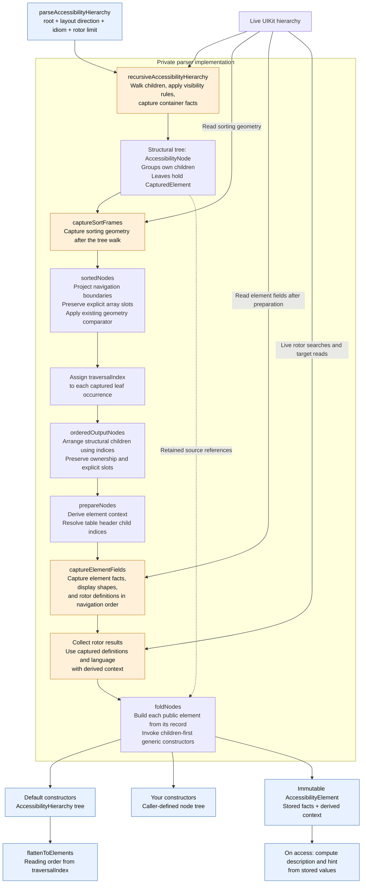
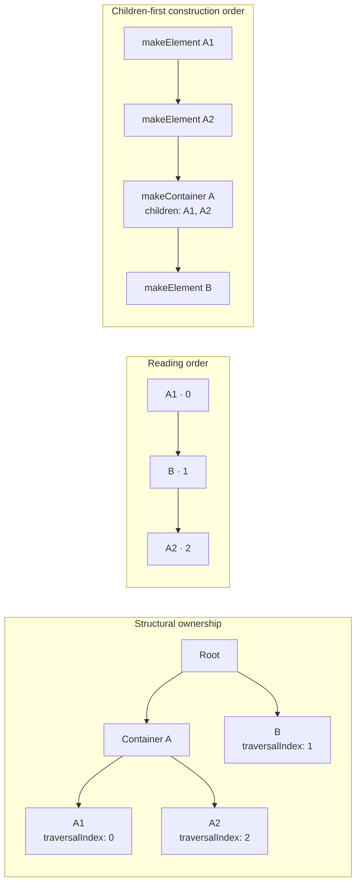
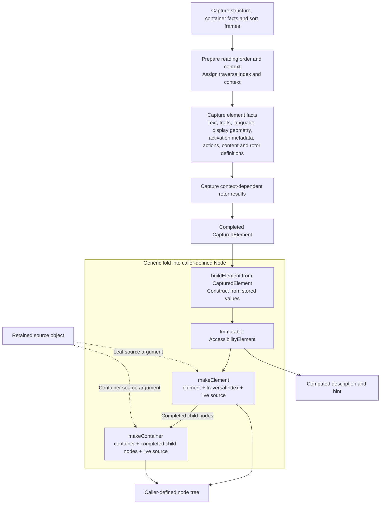

# Parser design

## 1. The parser pipeline

Blue is the public API/model. Orange marks phases that read live UIKit data. Everything inside the parser box is private.



| Private type | What it carries |
|---|---|
| `CapturedElement` | Source identity, captured element facts and geometry, rotor definitions/results, derived context, traversal index |
| `ContainerInfo` | Source, role, navigation/context rules, tab/table facts, portable container payload |
| `AccessibilityNode` | Either a captured leaf or a group of child nodes |

The structural walk finishes before sort-frame capture because container text getters can settle descendant layout. Sorting and context preparation consume captured data. Element fields are then captured in navigation order, followed by context-dependent rotor searches. All live reads finish before the generic fold constructs public elements and invokes caller constructors.

## 2. Structural ownership and reading order

The tree answers “who owns this?” The traversal index answers “when is this visited?”

Here, container A owns A1 and A2, while B falls between them in reading order.



The structural and navigation projections share the same `CapturedElement` instances. Assigning an index or context updates the record that both projections refer to.

Constructor invocation order follows the structural fold. Consumers use the supplied traversal indices when they need reading order.

## 3. Building the public result

The private intermediate record is mutable during capture and preparation. The public element has read-only properties and computed description/hint outputs. Its context can be attached through the parser-only `addContext(_:)` SPI. The current parser still constructs the public element from its completed private record during the fold.



Each leaf constructs its public element when the generic fold reaches it. There is no separate public-element array or traversal-index lookup. All UIKit getters and rotor searches finish before the fold begins, so caller mutations do not affect later public elements.

The caller-supplied generic constructors retain their signatures:

```swift
makeElement: (AccessibilityElement, Int, NSObject) -> Node
makeContainer: (AccessibilityContainer, [Node], NSObject) -> Node
```

### Source ownership

The parser holds strong references to the original live sources during its synchronous call and passes those exact objects to the caller's constructors. All working records are local to the call; the parser keeps no source references after returning. UIKit or caller-owned objects may still retain the sources, so this does not guarantee their deallocation.

The library-supplied constructors ignore the sources; the returned `AccessibilityHierarchy` contains captured values only.

Custom constructors control their own ownership. Storing a source strongly in a returned node or elsewhere keeps it alive beyond parsing and can retain its UI hierarchy. An ownership cycle can leak those objects. Use weak references for source associations that should not extend the UI object's lifetime. The captured public values remain usable independently of the live sources.
