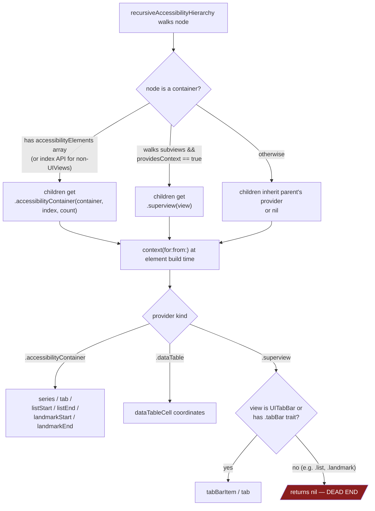
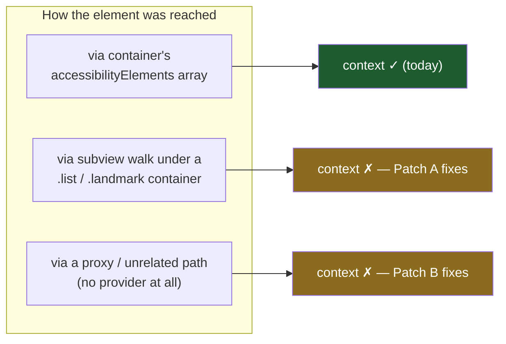
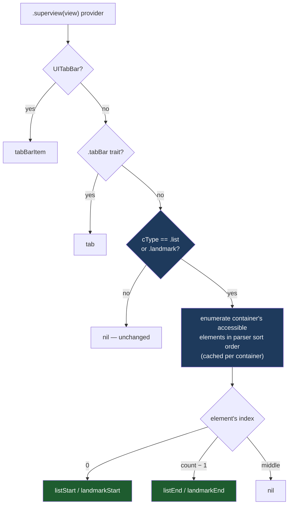
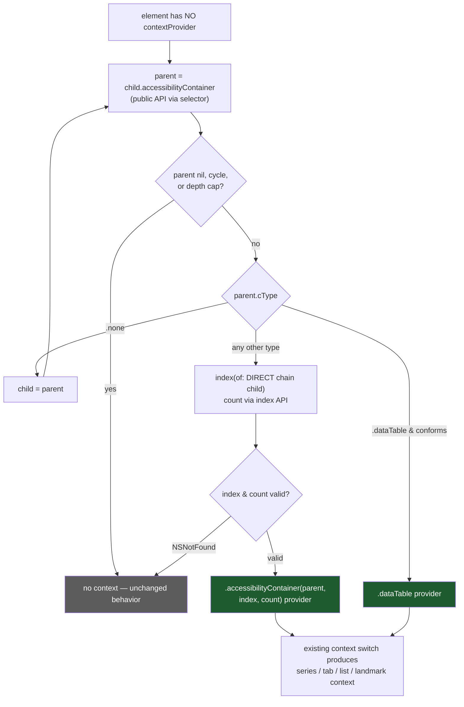
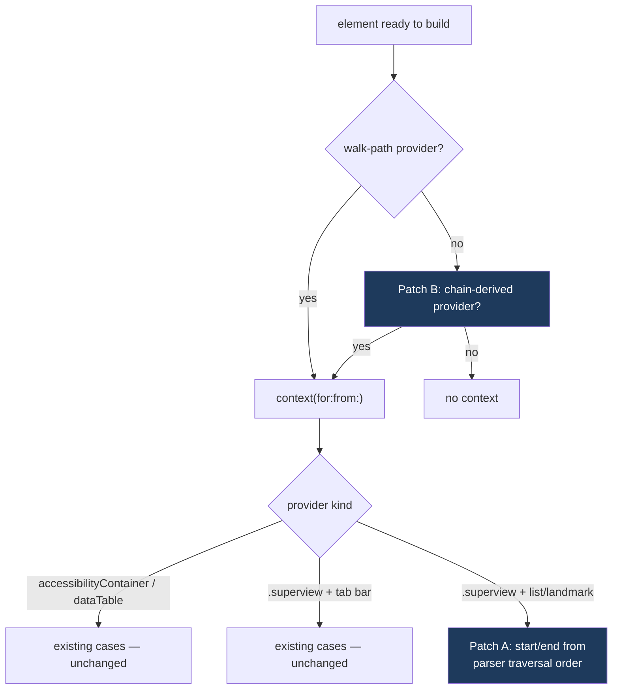
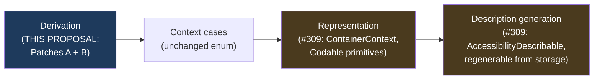

# Proposal: Complete Element Context Derivation (List/Landmark + Container-Chain Fallback)

**Status:** Draft
**Affects:** `AccessibilityHierarchyParser` (context derivation only — no changes to element discovery, ordering, or pruning)
**Validated against:** `_accessibilityLeafDescendantsWithOptions:` SPI probes on iOS 18.5 simulator; binary analysis of iOS 16.2 and 26.5 runtimes. Diagnostic fixtures live in `Example/UnitTests/UIViewIndexAPIValidationTests.swift`.

## Summary

The parser attaches *context* to elements — "List Start.", "List End.", "Tab 2 of 5", data-table cell coordinates — based on **how the traversal reached the element**. This works when an element is reached through its semantic container, and silently produces nothing when it isn't. Two changes close the gap:

- **Patch A** — finish the half-built `.superview` context path so `.list` / `.landmark` containers whose children are plain subviews produce start/end context.
- **Patch B** — when the traversal provides no context at all, walk the element's public `accessibilityContainer` back-pointer chain to find its real semantic container and derive context from it.

Both patches only add context where the parser currently emits none. Neither changes which elements are found or their order.

## Background: how context flows today

The recursive walk threads a `ContextProvider` downward. It is created at a container boundary and consumed once, when the element is converted to output:



The dead end is not hypothetical. `providesContext` (parser line ~1106) deliberately returns `true` for `accessibilityContainerType == .list` and `.landmark`, so the `.superview(listView)` provider is created and threaded all the way to `context(for:)` — which has no case for it. Provider wired, consumer never written.

## The gap, measured

Three fixtures, same two-label list, reached three different ways (`testDiagnostic_contextGapViaContainerChain`):

| Fixture | Parser output today | Element's own `accessibilityContainer` chain |
|---|---|---|
| `.list` container, children in explicit `accessibilityElements` array | "First. **List Start.**" / "Last. **List End.**" | list ancestor found; `index(of:)`=0/1, count=2 |
| `.list` container, children as plain subviews | "First" / "Last" — **context silently lost** | list ancestor found; `index(of:)`=**NSNotFound** |
| UITableView rows (walked via cell subviews) | "Row 0" … — no list context (**correct**: UITableView reports semanticGroup, not list) | UITableView ancestor; `index(of:)`=row, count=30 — **index API works through the chain** |



Key facts established by the probes:

1. **UIKit treats subview-based lists as real lists.** In the grouped-traversal collapse matrix, a `cType=.list` container *always* collapses to a single unit under `honorsElementGrouping`, whether its children come from subviews or arrays, labeled or not. The declaration alone carries the semantics; nothing requires the index API.
2. **The index API is not implemented for subview-based containers.** `index(ofAccessibilityElement:)` returns `NSNotFound` on a plain `.list` UIView. So position must come from *our own traversal order* in that case — the back-pointer alone cannot fix Patch A's case.
3. **The index API works through the chain for real container classes.** UITableView answers `index(of:)`/`count` correctly for elements found via the chain — so chain + index API is a sound fallback when a provider is missing entirely (Patch B's case).
4. **`accessibilityContainer` is public API, callable on anything.** Declared on `UIAccessibilityElement` (UIAccessibilityElement.h:31); implemented as an NSObject category, so `NSObject().responds(to:)` is `true` and returns nil. Swift needs `NSSelectorFromString` only because the NSObject declaration isn't in a public header. This is not SPI.

## Patch A: consume the `.superview` provider for `.list` / `.landmark`

### Design

Add a case to the `.superview` branch of `context(for:)`, mirroring the tabBar-trait sub-branch that already solves the identical subproblem ("what is this element's position among a container view's accessible elements?"):

```swift
// In context(for:from:...), .superview(view) branch, AFTER the tab bar checks:
let containerType = view.accessibilityContainerType
if containerType == .list || containerType == .landmark {
    let accessibleElements: [NSObject]
    if let cached = containerElementsCache[view] {
        accessibleElements = cached
    } else {
        let hierarchy = view.recursiveAccessibilityHierarchy(isRoot: true, options: options)
        accessibleElements = sortedElements(
            for: hierarchy, explicitlyOrdered: false, in: view,
            userInterfaceLayoutDirection: userInterfaceLayoutDirection,
            userInterfaceIdiom: userInterfaceIdiom
        ).map { $0.object }
        containerElementsCache[view] = accessibleElements
    }

    guard let index = accessibleElements.firstIndex(of: element) else { return nil }
    if index == 0 {
        return containerType == .list ? .listStart : .landmarkStart
    } else if index == accessibleElements.count - 1 {
        return containerType == .list ? .listEnd : .landmarkEnd
    }
    return nil
}
```



### Semantics inherited (by design, not accident)

- **if / else-if order** reproduces the documented single-element rule (parser line ~98): an only child gets `listStart` alone. Identical to the array path (lines ~509–523).
- **Outermost-provider-wins** (`contextProvider ?? …` at the walk sites) means a list nested in a list attributes elements to the outer list — already the array path's behavior. The two declaration styles become consistent rather than gaining new policy.
- **Ordering** comes from `sortedElements`, the parser's canonical order — first/last agree with output order by construction.
- **No UIView requirement on the element**: identity lookup (`firstIndex(of:)`) works for vended NSObjects that inherited the outer provider.
- **Tab checks stay first**: a pathological view with both the `.tabBar` trait and `.list` type keeps today's tab behavior.

### Cost

One extra recursive walk per list/landmark container encountered, memoized (generalize `tabBarCache` to a shared per-container cache, or add a sibling). Zero cost for hierarchies without such containers.

## Patch B: container-chain fallback when no provider exists

### Design

Only when the walk produced **no** provider (`contextProvider == nil`), walk the element's `accessibilityContainer` chain upward to the nearest ancestor with `accessibilityContainerType != .none`, and — if that ancestor actually implements the element-index API — synthesize the same `.accessibilityContainer` provider the array path would have produced:

```swift
private func chainDerivedProvider(for element: NSObject) -> ContextProvider? {
    let sel = NSSelectorFromString("accessibilityContainer")
    var child: NSObject = element
    var visited = Set<ObjectIdentifier>([ObjectIdentifier(element)])

    for _ in 0 ..< maxChainDepth {  // depth cap; weak refs can also nil out mid-walk
        guard let parent = child.perform(sel)?.takeUnretainedValue() as? NSObject,
              visited.insert(ObjectIdentifier(parent)).inserted  // cycle guard
        else { return nil }

        if parent.accessibilityContainerType == .dataTable,
           let dataTable = parent as? UIAccessibilityContainerDataTable {
            return .dataTable(dataTable)
        }

        if parent.accessibilityContainerType != .none {
            // Ask about the DIRECT chain child, not the leaf: containers like
            // UITableView index their immediate wrappers, not nested text elements.
            let index = parent.index(ofAccessibilityElement: child)
            let count = parent.accessibilityElementCount()
            guard index != NSNotFound, count != NSNotFound, index >= 0, index < count else {
                return nil  // subview-based container — Patch A's territory, chain can't order it
            }
            return .accessibilityContainer(parent, elementIndex: index, elementCount: count)
        }

        child = parent
    }
    return nil
}
```

Wired in at element-build time:

```swift
let provider = element.contextProvider ?? chainDerivedProvider(for: element.object)
```

And at the second call site that reaches elements outside the walk — rotor result markers (`AccessibilityElement.CustomRotor.init(from:parentElement:root:context:resultLimit:)`). Today each `result.targetElement` is described with the **rotor owner's** context; with the fallback available, each target derives its own:

```swift
// Before: element.accessibilityDescription(context: context)          // owner's context
// After:  element.accessibilityDescription(context: targetContext(element))  // target's own, chain-derived
```



### Why "direct chain child" matters

The chain for a table row is `UITableTextAccessibilityElement ↑ UITableViewCellAccessibilityElement ↑ UITableView`. The table indexes its immediate wrappers — asking `index(of: leafTextElement)` fails; asking `index(of: cellWrapper)` returns the row. The walk tracks the previous node for exactly this reason.

### Safety properties

- **Weak pointer**: chain can nil out mid-walk → walk just ends, context is nil, behavior unchanged.
- **Cycle guard** via `ObjectIdentifier` set; **depth cap** (~15) bounds pathological chains.
- **Never overrides** a walk-derived provider — fallback only. Zero behavior change for any element that has context today.
- **No class-name matching** on private wrappers — only property reads (`accessibilityContainerType`, index API) that are public.

## Combined pipeline after both patches



Precedence: walk-path provider → chain fallback → nothing. Patch A extends what a `.superview` provider can produce; Patch B extends where a provider can come from. They compose without interacting.

## What each patch fixes in practice

| Scenario | Today | After A | After B |
|---|---|---|---|
| Custom UIKit view marked `.list`, children as subviews (menus, forms) | no boundaries | **List Start / List End** | — |
| Same, marked `.landmark` | no boundaries | **Landmark boundaries** | — |
| **Custom rotor result markers** (`AccessibilityElement+UIKit.swift:22`): targets are reached via `result.targetElement`, outside any traversal path, and are described with the **rotor owner's** context rather than their own | wrong/missing context in shipped output | — | **each target gets its own chain-derived context** |
| Elements vended through a proxy view's `accessibilityElements` (our SPI comparison harness; any re-hosted elements) | all context lost | — | **restored** when the real container implements the index API |
| UITableView rows | no list context | unchanged (**correct** — table reports semanticGroup) | unchanged via walk; chain available if reached without a provider |
| Explicit-array lists, tab bars, segmented controls, data tables | works | unchanged | unchanged |

## Test plan

- Promote the diagnostic fixtures into assertions:
  - `.list` + subviews → "First. List Start." / "Last. List End." (Patch A)
  - `.landmark` twin; single-element list (start only); nested list (outer wins — pins inherited semantics)
  - Proxy-vended elements from a real container → context restored (Patch B); proxy-vended from a subview-based container → still nil, no crash
  - Custom rotor whose targets live in a segmented control / list / data table → each result marker's description carries the target's own context, not the rotor owner's (Patch B)
  - Chain edge cases: cycle guard, depth cap, chain that dies mid-walk
- Full snapshot run: references may legitimately change only where fixtures contain `.list`/`.landmark` containers with subview children. Audit any diff.
- Existing SPI-parity suite (12 scroll fixtures × 3 configurations) must stay green — neither patch touches discovery, ordering, or pruning.

## Relationship to upstream PR #309 (ContainerContext / AccessibilityDescribable)

[cashapp/AccessibilitySnapshot#309](https://github.com/cashapp/AccessibilitySnapshot/pull/309) refactors how context is **represented and consumed**: `Context` (live NSObject refs) becomes Codable `ContainerContext` primitives, and `AccessibilityDescribable` unifies description generation so stored elements can regenerate descriptions later. This proposal changes how context is **derived**. The layers compose:



- **No semantic conflict**: Patches A/B emit only existing `Context` cases; #309's mapping handles their output without modification.
- **#309 raises the stakes for derivation**: once descriptions regenerate from *stored* context, derivation-time gaps are frozen into the serialized model permanently. A and B fix the source data #309 makes durable.
- **Sequencing**: land #309 first; rebase A/B onto it. Both touch the `context(for:from:)` region (mechanical conflicts), and #309 renames `UIAccessibility+SnapshotAdditions.swift` → `UIAccessibility+RotorAdditions.swift`, which moves Patch B's rotor call site.
- **Rotor fix improves post-#309**: chain-derived provider → `Context` → stored `ContainerContext` on the result marker flows through the new unified path instead of today's inline description call.

## Open questions

1. **VoiceOver ground truth for subview-based lists.** Strong indirect evidence says boundaries are announced (UIKit's own walker honors the declaration; Apple docs promise it; the array path already announces for identical semantics). Worst case we announce boundaries VO skips — a fidelity question worth one on-device VO session, not a blocker.
2. **Cache naming**: generalize `tabBarCache` vs. add a parallel `containerElementsCache`. Cosmetic; generalizing touches the tab path, a sibling cache doesn't.
3. **Patch B scope**: currently proposed for *all* `cType != .none` ancestors (series/tab/list/landmark/dataTable all flow through the existing switch). Could be narrowed to list/landmark/dataTable if we want minimal blast radius initially.

## Appendix: SPI findings that informed this design

- `UIAccessibilityElementTraversalOptions.honorsElementGrouping` collapse predicate (measured on iOS 18.5): `cType ∈ {dataTable, list, landmark, and private values 1–3, 5–11, 13–15}` always collapse; `semanticGroup (4)` and private `12` collapse only with a non-nil `accessibilityLabel`/`attributedLabel` (value/identifier/hint/userInputLabels do NOT qualify); `shouldGroupAccessibilityChildren` is entirely irrelevant.
- Symbol/ABI stability: the SPI surface (`_accessibilityLeafDescendantsWithOptions:`, traversal-options class, `_accessibilityHasVisibleFrame` with its 2pt threshold) is structurally identical from iOS 16.2 through 26.5 — but the parser patches here rely only on **public** API (`accessibilityContainer`, `accessibilityContainerType`, `index(ofAccessibilityElement:)`, `accessibilityElementCount()`); the SPI is used exclusively as test-side ground truth.
