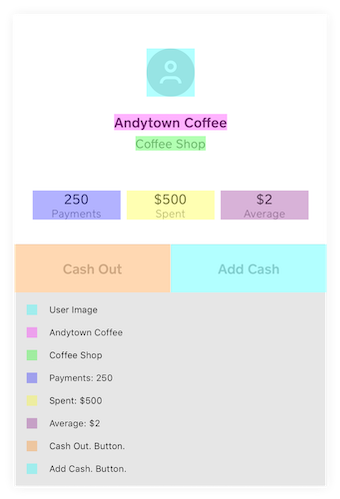

# AccessibilitySnapshot

[](https://github.com/CashApp/AccessibilitySnapshot/actions?query=workflow%3ACI+branch%3Amaster)
[](https://cocoapods.org/pods/AccessibilitySnapshot)
[](https://cocoapods.org/pods/AccessibilitySnapshot)
[](https://cocoapods.org/pods/AccessibilitySnapshot)

AccessibilitySnapshot makes it simple to add regression tests for accessibility in iOS apps. The framework builds on the idea of snapshot testing to provide snapshots of the accessibility hierarchy.

<p align="center">
    
</p>

## Getting Started

By default, AccessibilitySnapshot uses [SnapshotTesting](https://github.com/pointfreeco/swift-snapshot-testing) to record snapshots and perform comparisons. The framework also includes support for using [iOSSnapshotTestCase](https://github.com/uber/ios-snapshot-test-case) as the snapshotting engine instead. Before setting up accessibility snapshot tests, make sure your project is set up for standard snapshot testing. Accessibility snapshot tests require that the test target has a host application. See the [Extensions](#extensions) section below for a list of other available snapshotting options.

<details>
<summary><h3>CocoaPods</h3></summary>

Install with [CocoaPods](https://cocoapods.org) by adding the following to your `Podfile`:

```ruby
pod 'AccessibilitySnapshot'
```

To use only the core accessibility parser, add a dependency on the Core subspec alone:

```ruby
pod 'AccessibilitySnapshot/Core'
```

Alternatively, if you wish to use [iOSSnapshotTestCase](https://github.com/uber/ios-snapshot-test-case) to perform image comparisons, you can add a dependency on the `iOSSnapshotTestCase` subspec instead (or in addition - you can use both in the same project):

```ruby
pod 'AccessibilitySnapshot/iOSSnapshotTestCase'
```
</details>

<details>
<summary><h3>Swift Package Manager</h3></summary>

Install with [Swift Package Manager](https://swift.org/package-manager/) by adding the following to your `Package.swift`:

```swift
dependencies: [
    .package(name: "AccessibilitySnapshot", url: "https://github.com/cashapp/AccessibilitySnapshot.git", from: "0.4.1"),
]
```

Next, add AccessibilitySnapshot as a dependency to your test target:

```swift
targets: [
    .target(name: "MyApp"),
    .testTarget(name: "MyAppTests", dependencies: ["MyApp", "AccessibilitySnapshot"])
]
```

To use only the core accessibility parser, add a dependency on the Core library alone:

```swift
targets: [
    .target(name: "MyApp"),
    .testTarget(name: "MyAppTests", dependencies: ["MyApp", "AccessibilitySnapshotCore"])
]
```

To use [iOSSnapshotTestCase](https://github.com/uber/ios-snapshot-test-case) to perform image comparisons, add a dependency on `FBSnapshotTestCase+Accessibility` for Swift testing or `FBSnapshotTestCase+Accessibility-ObjC` for Objective-C.

```swift
targets: [
    .target(name: "MyApp"),
    .testTarget(name: "MyAppTests", dependencies: ["MyApp", "FBSnapshotTestCase+Accessibility"])
]
```
</details>

<details>
<summary><h3>Carthage</h3></summary>

Only the core accessibility parser (not the snapshot integration layers) can be installed via Carthage. To install AccessibilitySnapshotCore via [Carthage](https://github.com/Carthage/Carthage), add the following to your `Cartfile`:

```ogdl
github "cashapp/AccessibilitySnapshot"
```
</details>

<details>
<summary><h3>Bazel</h3></summary>

Add the following to your `MODULE.bazel` file:

```starlark
bazel_dep(
    name = "accessibility_snapshot",
    version = "x.x.x",
)
```

Use the provided targets in the `BUILD.bazel` files. There is a `*_library` target for each target suffixed with `.lib` that can be used as a dependency. Without the suffix you will get an `ios_framework` target (dynamic).

```starlark

swift_library(
    name = "MyLibrary",
    ...,
    deps = [
        "//Sources/AccessibilitySnapshot/Core:AccessibilitySnapshotCore.lib",
    ],
)
```

To use [iOSSnapshotTestCase](https://github.com/uber/ios-snapshot-test-case) you can add a dependency on the `//Sources/AccessibilitySnapshot/iOSSnapshotTestCase:AccessibilitySnapshot_iOSSnapshotTestCase` targets.

For example:

```starlark
swift_test(
    name = "MyLibraryTests",
    ...,
    deps = [
        "//Sources/AccessibilitySnapshot/Core:AccessibilitySnapshotCore.lib",
        "//Sources/AccessibilitySnapshot/iOSSnapshotTestCase:AccessibilitySnapshot_iOSSnapshotTestCase",
    ],
)
```

```swift
import AccessibilitySnapshot_iOSSnapshotTestCase
```

To use [SnapshotTesting](https://github.com/pointfreeco/swift-snapshot-testing) you can add a dependency on the `//Sources/AccessibilitySnapshot/SnapshotTesting:AccessibilitySnapshot_SnapshotTesting` targets.

For example:

```starlark
swift_test(
    name = "MyLibraryTests",
    ...,
    deps = [
        "//Sources/AccessibilitySnapshot/Core:AccessibilitySnapshotCore.lib",
        "//Sources/AccessibilitySnapshot/SnapshotTesting:AccessibilitySnapshot_SnapshotTesting",
    ],
)
```

```swift
import AccessibilitySnapshot_SnapshotTesting
```

</details>

## Usage

AccessibilitySnapshot builds on top of existing snapshot frameworks to add support for snapshotting your app's accessibility. By default it uses the [SnapshotTesting](https://github.com/pointfreeco/swift-snapshot-testing) framework for snapshotting, but can be switched over to [iOSSnapshotTestCase](https://github.com/uber/ios-snapshot-test-case) as well.

### Getting Started with SnapshotTesting

AccessibilitySnapshot provides an `.accessibilityImage` snapshotting strategy that can be used with SnapshotTesting's snapshot assertions.

```swift
func testAccessibility() {
    let view = MyView()
    // Configure the view...

    assertSnapshot(matching: view, as: .accessibilityImage)
}
```

Snapshots can also be customized in a few ways, for example controlling when to include indicators for the accessibility activation point of each element. By default, these indicators are shown when the activation point is different than the default activation point for that view. You can override this behavior for each snapshot:

```swift
func testAccessibility() {
    let view = MyView()
    // Configure the view...

    // Show indicators for every element.
    assertSnapshot(matching: view, as: .accessibilityImage(showActivationPoints: .always))

    // Don't show any indicators.
    assertSnapshot(matching: view, as: .accessibilityImage(showActivationPoints: .never))
}
```

### Getting Started with iOSSnapshotTestCase

To run a snapshot test, simply call the `SnapshotVerifyAccessibility` method:

```swift
func testAccessibility() {
    let view = MyView()
    // Configure the view...

    SnapshotVerifyAccessibility(view)
}
```

Since AccessibilitySnapshot is built on top of iOSSnapshotTestCase, it uses the same mechanism to record snapshots (setting the `self.recordMode` property) and supports many of the same features like device agnostic file names and specifying identifiers for each snapshot:

```swift
func testAccessibility() {
    let view = MyView()
    // Configure the view...

    SnapshotVerifyAccessibility(view, identifier: "identifier")
}
```

Snapshots can also optionally include indicators for the accessibility activation point of each element. By default, these indicators are shown when the activation point is different than the default activation point for that view. You can override this behavior for each snapshot:

```swift
func testAccessibility() {
    let view = MyView()
    // Configure the view...

    // Show indicators for every element.
    SnapshotVerifyAccessibility(view, showActivationPoints: .always)

    // Don't show any indicators.
    SnapshotVerifyAccessibility(view, showActivationPoints: .never)
}
```

You can also run accessibility snapshot tests from Objective-C:

```objc
- (void)testAccessibility;
{
    UIView *view = [UIView new];
    // Configure the view...

    SnapshotVerifyAccessibility(view, @"identifier");
}
```

## Requirements

* Xcode 13.2.1 or later
* iOS 13.0 or later

## Contributing

We love our
[contributors](https://github.com/CashApp/AccessibilitySnapshot/graphs/contributors)!
Please read our [contributing guidelines](CONTRIBUTING.md) prior to submitting
a pull request.

## Extensions

Have you written your own extension? [Add it here](https://github.com/cashapp/AccessibilitySnapshot/edit/master/README.md) and submit a pull request!

* [PlaybookAccessibilitySnapshot](https://github.com/playbook-ui/accessibility-snapshot-ios) brings accessibility snapshot testing support to [Playbook](https://github.com/playbook-ui/playbook-ios).

## License

```
Copyright 2020 Square Inc.

Licensed under the Apache License, Version 2.0 (the "License");
you may not use this file except in compliance with the License.
You may obtain a copy of the License at

    http://www.apache.org/licenses/LICENSE-2.0

Unless required by applicable law or agreed to in writing, software
distributed under the License is distributed on an "AS IS" BASIS,
WITHOUT WARRANTIES OR CONDITIONS OF ANY KIND, either express or implied.
See the License for the specific language governing permissions and
limitations under the License.
```
